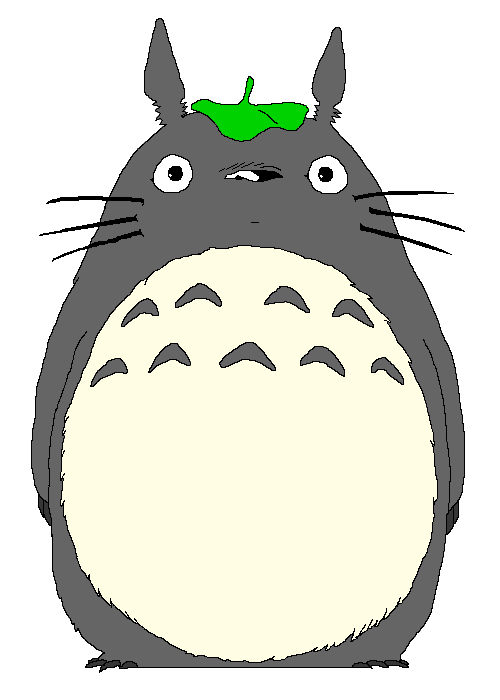

##  Hello there!  

##  I'm Steve Francis King C. Pada!
Aspiring Software Developer/AI Engineer/Game Programmer Junior Student of Visayas State University 

- 🔭 I’m currently working on Rekindle - A VSU Exploration Game
- 🌱 I’m currently learning Web and Game Development, and Machine Learning
- 👾 Current Game Development Progrmaming Co-head, DS2 Mentor, CS3 External Secretary, and Caption Writer of the CS3-FC Media Committee
- ⚡ Fun fact: I don't like glitters -,-

##  Tech Stacks and Languages

##  My Github Stats

  
  

##  Feel Free to Contact Me

    
    
    
    

Always looking forward with future collaborations!

<!--
**padastevefrancisking/padastevefrancisking** is a ✨ _special_ ✨ repository because its `README.md` (this file) appears on your GitHub profile.

Here are some ideas to get you started:

-->

